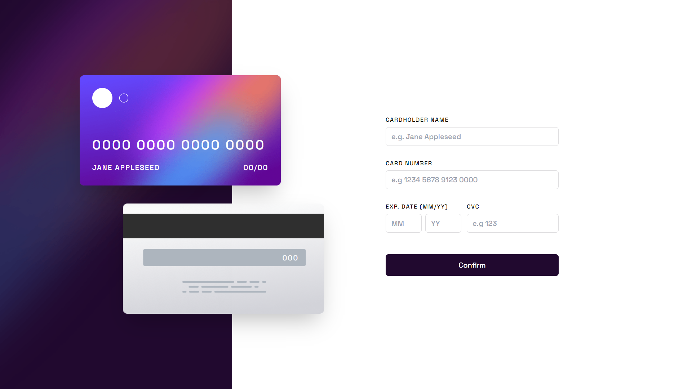

<!-- FEM Logo -->

  

  <h1 align="center">Interactive Card Details Form</h1>
  

    <a href="https://www.frontendmentor.io/solutions/interactive-card-details-form-with-identifyting-card-types-S0jo2QQbGf"><strong>Frontend Mentor Challenge</strong></a>
     
  

<!-- Bagdes -->

  <!-- Profile -->
   &nbsp;
  <!-- Status -->
     &nbsp;
  <!-- Difficulty -->
    

 
<!-- Live Site -->

  <a href="https://front-end-mentor-solutions-eight.vercel.app/">
    -9757f1?style=for-the-badge" alt="Live Demo">
  </a> &nbsp;
  <a href="https://github.com/IamArshadAli/FrontEndMentor-Solutions/tree/main/2-5-interactive-card-details-form-main/">
    -9757f1?style=for-the-badge" alt="Solution">
  </a>

#
<!-- Screenshot -->

  

This is a solution to the [Interactive Card Details Form challenge on Frontend Mentor](https://www.frontendmentor.io/challenges/interactive-card-details-form-XpS8cKZDWw). Frontend Mentor challenges help you improve your coding skills by building realistic projects.

 

## Pagespeed Insights Score:

 ||
  | :-----: |
  |  <b>Overall Score: 🖥️ 99% \| 📱 95%</b> |
  | |
  |  |
  | |
  | Check out [**Pagespeed Insights**](https://pagespeed.web.dev/analysis/https-front-end-mentor-solutions-eight-vercel-app/75co3mk81h?form_factor=desktop) to get live score |
  ||

 

## ⚔️ The Challenge

Your users should be able to:

- [✔️] Fill in the form and see the card details update in real time
- [✔️] Receive error messages when the form is submitted if:
    - [✔️] Any input field is empty
    - [✔️] The card number, expiry date, or CVC fields are in the wrong format
    - [✔️] View the optimal layout depending on their device's screen size
    - [✔️] See hover, active, and focus states for interactive elements on the page

 

## 🔥 Features

- ✅ Validates card number including
    - |||
      | :---- | :---- |
      | 💳 Card Type | 🔢 Example Input |
      | Visa Card | `4111 1111 1111 1111` |
      | Master Card | `5555 5555 5555 4444` |
      | American Express Card | `3782 8224 6310 005` |
      |||

- 💳 Displays a card type icon corresponding to the card number

 

## ⚙️ Built with 🤍 using

  &nbsp;  &nbsp;  &nbsp; 

 

## 📑 Useful Resources

- [BEM 101](https://css-tricks.com/bem-101/) - A quick guide about `BEM (Block Element Modifier)`
- [Luhn Algorithm](https://en.wikipedia.org/wiki/Luhn_algorithm) - An algorithm to validate the card number
- [Regular Expression](https://developer.mozilla.org/en-US/docs/Web/JavaScript/Guide/Regular_expressions) - Patterns that are used to match character combinations in strings
- [TailwindCSS](https://tailwindcss.com/docs/installation) - A simplest and fastest way to write CSS

 

## 🪴 Acknowledgements

  
Took some design refrence from

  
  
(A guy having pixel perfect Solutions)

 

## 👋 Say Hii... 👇

   &nbsp;
   &nbsp;
  

 

>Code Together &nbsp;&nbsp;|&nbsp;&nbsp; Learn Together &nbsp;&nbsp;|&nbsp;&nbsp; Grow Together