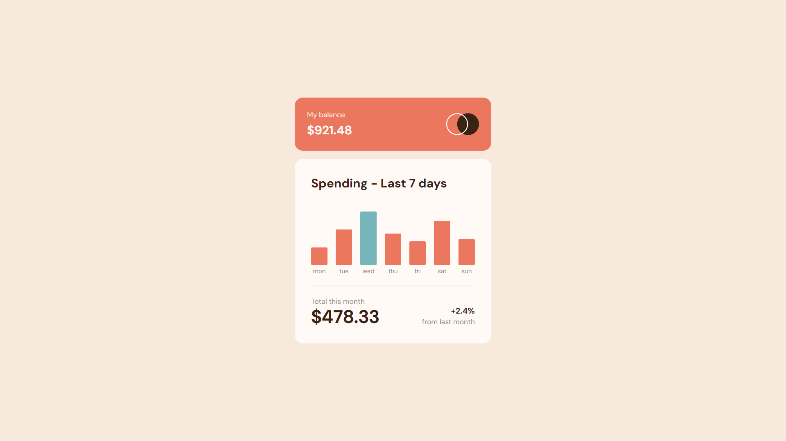

<!-- FEM Logo -->

  

  <h1 align="center">Expenses Chart Component</h1>
  

    <a href="https://www.frontendmentor.io/solutions/dynamic-expenses-chart-component-using-reactjs-and-tailwindcss-wOp4uhodH_"><strong>Frontend Mentor Challenge</strong></a>
     
  

<!-- Bagdes -->

  <!-- Profile -->
   &nbsp;
  <!-- Status -->
     &nbsp;
  <!-- Difficulty -->
    

 
<!-- Live Site -->

  <a href="https://expenses-chart-component-arshad-ali.vercel.app/">
    -9757f1?style=for-the-badge" alt="Live Demo">
  </a> &nbsp;
  <a href="https://github.com/IamArshadAli/FrontEndMentor-Solutions/tree/main/2-6-expenses-chart-component-main">
    -9757f1?style=for-the-badge" alt="Solution">
  </a>

#
<!-- Screenshot -->

  

This is a solution to the [Expenses Chart Component challenge on Frontend Mentor](https://www.frontendmentor.io/challenges/expenses-chart-component-e7yJBUdjwt). Frontend Mentor challenges help you improve your coding skills by building realistic projects.

 

## Pagespeed Insights Score:

 ||
  | :-----: |
  |  <b>Overall Score: 🖥️ 99% \| 📱 99%</b> |
  | |
  |  |
  | |
  | Check out [**Pagespeed Insights**](https://pagespeed.web.dev/analysis/https-expenses-chart-component-arshad-ali-vercel-app/ygc3esl8nf?form_factor=desktop) to get live score |
  ||

 

## ⚔️ The Challenge

Your users should be able to:

- [✔️] View the bar chart and hover over the individual bars to see the correct amounts for each day
- [✔️] See the current day's bar highlighted in a different colour to the other bars
- [✔️] View the optimal layout for the content depending on their device's screen size
- [✔️] See hover states for all interactive elements on the page
- [✔️] **Bonus**: See dynamically generated bars based on the data provided in the local JSON file

 

## ⚙️ Built with 🤍 using

  &nbsp;  &nbsp;  &nbsp; 

 

## 🤝 Let's Connect 👇

   &nbsp;
   &nbsp;
  

 

>Code Together &nbsp;&nbsp;|&nbsp;&nbsp; Learn Together &nbsp;&nbsp;| &nbsp;&nbsp;Grow Together